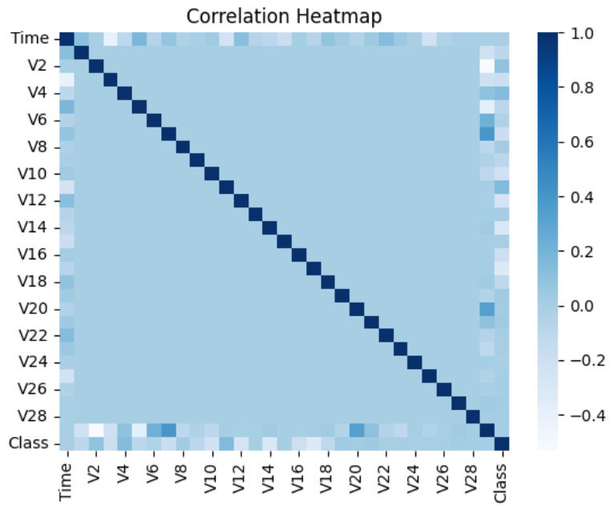

# CREDIT CARD FRAUD DETECTION

Credit card fraud detection is a critical task in financial security. This project aims to develop a robust model that can accurately classify transactions as either fraudulent or non-fraudulent. We utilized a logistic regression model due to its effectiveness in binary classification problems. The dataset used for training and evaluation was sourced from Kaggle and consists of 31 features, each providing various information about the transactions.

 Dataset:

The dataset was obtained from Kaggle and contains the following features:

- Time: Number of seconds elapsed between this transaction and the first transaction in the dataset.

- V1 to V28: The result of a PCA transformation. Due to confidentiality issues, the original features are not provided.

- Amount: The transaction amount.

- Class: The target variable, where 1 indicates a fraudulent transaction and 0 indicates a non-fraudulent transaction.

for more details on the dataset, visit: ``` https://www.kaggle.com/datasets/mlg-ulb/creditcardfraud ``` 

## Table of Contents

- [Usage](#usage)
- [Model](#model)
- [Results](#results)
- [Contributing](#contributing)
- [Contact](#contact)
  

## Usage

To use this model, follow these steps:

1. Clone the repository:
  ```sh
   git clone https://github.com/Yadunandanv08/Creditcard-Fraud-Detection.git
   ```
2. Navigate to the project directory:
  ```sh
  cd Creditcard-Fraud-Detection
```
3. Install the required dependencies:
  ```sh
  pip install -r requirements.txt
```
## Model
 
A logistic regression model was employed for this task. Logistic regression is a widely used statistical method for binary classification problems. It is simple, efficient, and effective for this kind of application.

Key Steps in the Process:

1. Data Preprocessing: Handling missing values, scaling features, and splitting the data into training and testing sets.
2. Model Training: Training the logistic regression model on the training dataset.
3. Evaluation: Evaluating the model's performance using metrics such as accuracy, precision, recall, and the F1 score. 

## Results

The logistic regression model achieved the following performance metrics:

- Accuracy: 0.9035532994923858
- Precision: 0.9247311827956989
- Recall: 0.9247311827956989
- F1 Score: 0.900523560209424

##
  


## Contributing
Contributions and suggestions are welcome! To contribute, follow these steps:

Fork the repository.

Create a new branch (git checkout -b feature-branch).

Make your changes and commit them (git commit -m 'Add new feature').

Push to the branch (git push origin feature-branch).

Create a new Pull Request.

Please ensure your code follows our code of conduct and contribution guidelines.

## Contact
If you have any questions or suggestions, feel free to reach out at:

Email - yadunandanv08@gmail.com

Linkedin - https://www.linkedin.com/in/yadunandan-v-840255259/
        

   
